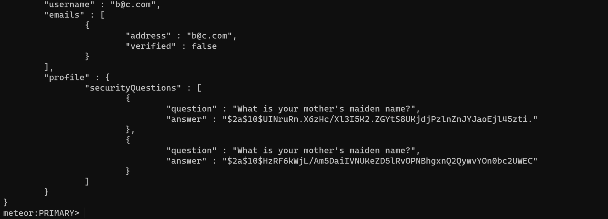
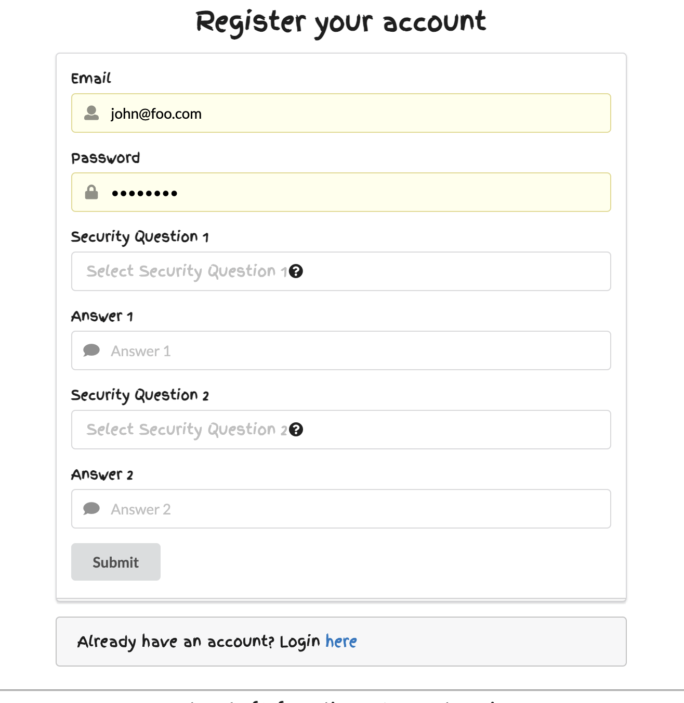
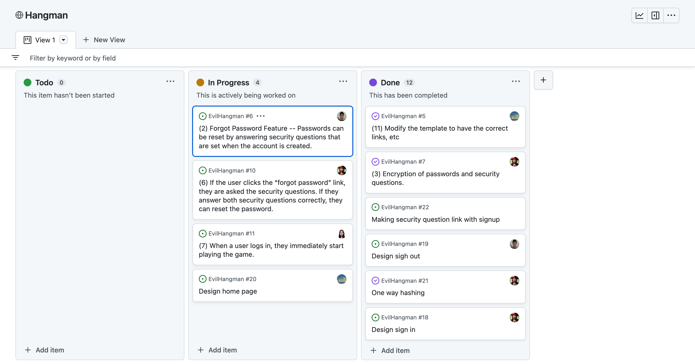

## What is complete so far, as of Feb 13, 2023:

We have a working application, but not a web application. The game is playable in CLI. 

## What is pending:
 1. Need to make the application into a web application using meteor react.
 2. Need to create a Mongo database.
 3. Link database by using meteor react
 4. Need to write code to make it secure. 
 5. Need to write code to create accounts, including a username, a password, and two security questions to reset the password.
 6. Need to ask users the number of guesses and size of the word.
 7. Need to write code to encrypt the passwords and security questions.7
 8. Need to prevent Mongodb Injection.

## What each team member has contributed and will be working on:
1. Zhixin Li
 a. Contribute to assignment 1, parts A, and part of part B.
 b. Assignments:
  i. Help to make the application into a web application. 
  ii. Creating meteor template importing to GitHub. 
2. Kai He
 a. Contribute to assignment 1, parts A, and part of part B. Fixing it to complete sentence. 
 b. Assignments:
  i. Updating the README file in GitHub. 
  ii. Help to make the application into a web application. 
  iii. I will create the code to ask for two security questions and passwords. 
3. Gregory Wilder
 a. Done so far: Creation of the source code of the game. Contributed to assignment 1, including edits. 
 b. Assignments: 
  i. Uploading the game source code to GitHub. 
  ii. Help to make the application into a web application. 
  iii. Create an Mongo database and provide credentials to the team.
  iiii. Need to prevent Mongodb Injection.
4. Malia Liu
 a. Contribute to assignment 1, part A, and part of part B. Fixing and providing a diagram. 
 b. Assignments: 
  i. Help to make the application into a web application.

< hr />
## README version for Assignment 3:

## Progress:

1. A working website with a simple design for the web application. 

2. Working security questions. They are created after the user signs up their account. Right now, the admin is the only person who can see those answers.

3. Working game function. 

4. Are to delete the account. It is available at the top left under the email tag. 

## Link:

Repository: https://github.com/ICS427-Hangman/EvilHangman

## Pending

What we left to do is make it more secure, and complete the other additional features.
Since we are currently saving security questions in the database in plain text, and an admin user has access to it, there is currently risk of leaking PII in a successful attack.
In a future version, the answers will be stored in a hashed format, so even if an attacker gets access to the database, the information will be useless to the attacker.

## Current & Upcoming Versions
For the Current and Upcoming versions, we have created a project board at Github. It shows the issues we are working on, as well as the completed issues.

Here is the link to it: https://github.com/orgs/ICS427-Hangman/projects/1

Here is an image

## README version for Assignment 4:

## What has been completed since the last README was submitted?

## Change #1

One-way hashing has been implemented for the stored security questions. When a user inputs their security questions, it is hashed so that even if the database were to be hacked, the information provided would be useless to the hacker. 

## Change #2

We modified the security questions and sign-up to be on the same page. Before this, the new user would be asked to set up security questions after they signed up. We determined it would be better to have the user answer the security questions while signing up. 

## Change #3

We fuzz tested our application. No fuzz tests revealed any security flaws, and so no fixes were needed at this time. 

Here is the link: https://docs.google.com/document/d/17k2cdH9R3MlN6fwwbVEN1DHX6IFzniOUn0UrN3zSXGo/edit

## What is pending now

## Pending # 1

We need to finalize the Forgot Password feature, to allow a user to reset their password if they successfully answer the security questions. 

## Pending # 2

When the user logs in, they immediately start playing the game.

## Who did what so far and what will each person be doing next

The GitHub project board keeps track of who was assigned which task, which tasks were finished by whom. 

Here is the link : https://github.com/orgs/ICS427-Hangman/projects/1/views/1

## Link of Reposistory:

Repository: https://github.com/ICS427-Hangman/EvilHangman
