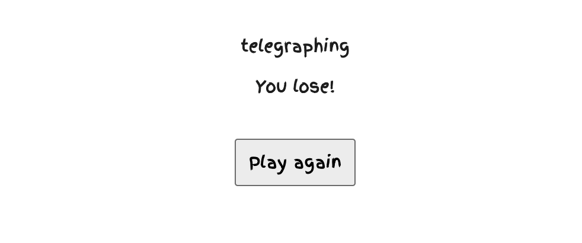

## What is complete so far:

We have a working application, but not a web application. The game is playable in CLI. 

## What is pending:
 1. Need to make the application into a web application using meteor react.
 2. Need to create a Mongo database.
 3. Link database by using meteor react
 4. Need to write code to make it secure. 
 5. Need to write code to create accounts, including a username, a password, and two security questions to reset the password.
 6. Need to ask users the number of guesses and size of the word.
 7. Need to write code to encrypt the passwords and security questions.7
 8. Need to prevent Mongodb Injection.

## What each team member has contributed and will be working on:
1. Zhixin Li
 a. Contribute to assignment 1, parts A, and part of part B.
 b. Assignments:
  i. Help to make the application into a web application. 
  ii. Creating meteor template importing to GitHub. 
2. Kai He
 a. Contribute to assignment 1, parts A, and part of part B. Fixing it to complete sentence. 
 b. Assignments:
  i. Updating the README file in GitHub. 
  ii. Help to make the application into a web application. 
  iii. I will create the code to ask for two security questions and passwords. 
3. Gregory Wilder
 a. Done so far: Creation of the source code of the game. Contributed to assignment 1, including edits. 
 b. Assignments: 
  i. Uploading the game source code to GitHub. 
  ii. Help to make the application into a web application. 
  iii. Create an Mongo database and provide credentials to the team.
  iiii. Need to prevent Mongodb Injection.
4. Malia Liu
 a. Contribute to assignment 1, part A, and part of part B. Fixing and providing a diagram. 
 b. Assignments: 
  i. Help to make the application into a web application.

< hr />
## README version for Assignment 3:

## Progress:

1. A working website with a simple design of web application. 

2. Working security questions. It appears when the user signup an account. Right now, the admin where the only person who can see those answers.

3. Working game function. 

4. Are to delete the account. It is available at the top left under the email tag. 

## Link:

Repository: https://github.com/ICS427-Hangman/EvilHangman

## Pending

What we left to do is make it more secure. Since we saving security question in db and only admin role had the access of it, but what happen if admin account is being hacked. We are working on hash those datas for more secure access. 

## Current && Next
For the Current and Next part, we had create a project borad at github. It has what issue we working on right now and issues to pick. Also compelted issues.

Here is the link to it: https://github.com/orgs/ICS427-Hangman/projects/1

Here is an image

